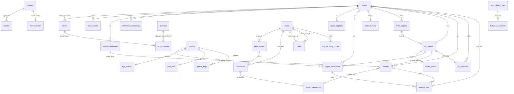

# CEX Database Architecture — Production MVP Design

> Senior Database Architect deliverable for the centralized crypto exchange.
> This document is the **canonical data-layer design**. It aligns with and supersedes
> `ARCHITECTURE.md §17` (the foundation slice) and extends it with the pieces required
> to *later* support spot trading, KuCoin liquidity, and multi-chain (TRC20 / ERC20 / BEP20)
> deposits. The live foundation migration (`20260612000000_init`) models only Users/Auth +
> Idempotency/Audit; everything else here is forward-design to be shipped phase-by-phase.

> **REV 2 (post production-readiness review).** This revision closes Critical
> issues **C2–C7** and High-priority issues **H1–H4**. The authoritative changes
> are consolidated in **§R — REV 2 Production-Hardening** below; the original
> §2–§8 remain as baseline context, and §R supersedes them where they differ.
> The Prisma schema (`backend/docs/schema.full.prisma`) is at REV 2 and validates.

**Engine:** PostgreSQL 16 · **ORM:** Prisma · **PK:** UUID v4 (`gen_random_uuid()`) ·
**Money:** `NUMERIC`, never float · **Deletes:** soft (`deleted_at`) on reference rows,
append-only on ledger/audit · **Ledger:** double-entry, balanced, projection-backed.

---

## 0. Design principles (non-negotiable)

| # | Principle | Mechanism |
|---|-----------|-----------|
| P1 | **Balances are derived, never mutated** | `ledger_entries` (append-only) is truth; `account_balances` is a projection updated in the *same* DB transaction; an invariant job re-checks `projection == SUM(entries)`. |
| P2 | **Every money event is balanced** | Each `ledger_transaction` has ≥2 `ledger_entries`; `SUM(signed amount) = 0`, enforced by a `CONSTRAINT TRIGGER` (deferred to commit). |
| P3 | **Money is exact** | `NUMERIC(38,18)` in the unified ledger; on-chain values additionally stored as integer base units `NUMERIC(78,0)`. No float anywhere. |
| P4 | **State machines, not booleans** | `status` enums with code-enforced transitions; illegal transitions blocked by partial constraints + service layer. |
| P5 | **Idempotency everywhere money moves** | Unique keys: on-chain `(chain, tx_hash, log_index)`; gateway `(provider, provider_event_id)`; client `Idempotency-Key` per `(user, endpoint)`; trade **`fill_id`** (deterministic engine fill id — REV 2, was the non-deterministic `(maker,taker,seq)`). |
| P6 | **Append-only is immutable** | `ledger_entries`, `trades`, `audit_logs`, `admin_logs` reject `UPDATE`/`DELETE` via revoked grants + triggers. Corrections are *reversing entries*, never edits. |
| P7 | **Soft delete for reference data** | `deleted_at timestamptz`; all read paths filter `deleted_at IS NULL`; uniqueness enforced via partial unique indexes so a deleted row frees its natural key. |
| P8 | **Asset- and chain-agnostic core** | The ledger references `assets` **and** `chains` reference *tables* (not enums — REV 2 promoted `chain`) so adding USDT-on-TRON, an ERC20/BEP20, a new L1, or a KuCoin-listed token is data, not a migration. |

---

## 1. Module → table map (the 16 modules)

| # | Module | Tables |
|---|--------|--------|
| 1 | Users | `users` |
| 2 | Roles | `roles`, `user_roles`, `admin_roles` |
| 3 | Permissions | `permissions`, `role_permissions` |
| 4 | KYC | `kyc_profiles`, `kyc_documents` |
| 5 | Wallets | `accounts` (ledger accounts = wallet balances), `account_balances` |
| 6 | Wallet Addresses | `deposit_addresses`, `withdrawal_addresses` |
| 7 | INR Ledger | `inr_transactions`, `payment_webhook_events`, `bank_accounts` |
| 8 | Deposits | `crypto_deposits`, `chain_cursors`, `sweeps` |
| 9 | Withdrawals | `crypto_withdrawals` |
| 10 | Transactions | `ledger_transactions`, `ledger_entries` |
| 11 | Orders | `orders` |
| 12 | Trades | `trades` |
| 13 | Admin Logs | `admins`, `admin_logs` |
| 14 | Audit Logs | `audit_logs` |
| 15 | Sessions | `auth_sessions`, `admin_sessions`, `login_attempts`, `totp_recovery_codes` |
| 16 | Idempotency Keys | `idempotency_keys` |
| — | Reference / markets | `chains`, `assets`, `asset_chains`, `markets` |
| — | Wallet infra *(REV 2)* | `chain_signers`, `hot_wallets`, `wallet_nonces` |
| — | Fiat conversion *(REV 2)* | `price_quotes`, `conversions` |
| — | Gas/fees *(REV 2)* | `gas_reserves`, `network_fees` |
| — | Market data *(REV 2)* | `candles`, `market_tickers` |
| — | Reconciliation *(REV 2)* | `reconciliation_runs`, `balance_snapshots` |

---

## §R — REV 2 Production-Hardening (authoritative)

Closes review items **C2–C7** and **H1–H4**. Where this section differs from §2–§8, **§R wins**.

### R.0 Change ledger

| Item | Review finding | Resolution |
|------|----------------|------------|
| H1 | `Chain` was an enum | New **`chains`** reference table; every `chain` column is now `citext FK → chains.id`. New chains/L1s are `INSERT`s. |
| Wallet infra | No signer/nonce model | New **`chain_signers`**, **`hot_wallets`**, **`wallet_nonces`** (authoritative per-wallet nonce allocator). |
| C2 | Nonce scoped `(chain, nonce)`; no sender | Added **`from_address`** + `hot_wallet_id`; unique now **`(chain, from_address, nonce)`**. |
| C7 | Dropped core tables | Restored **`conversions`**, **`price_quotes`**, **`totp_recovery_codes`**. |
| Recon | No reconcile tables | New **`sweeps`**, **`reconciliation_runs`**, **`balance_snapshots`**. |
| Trading/gas | No OHLCV/ticker/gas | New **`candles`**, **`market_tickers`**, **`gas_reserves`**, **`network_fees`**. |
| C3/C4 | Market-order lock undefined; no stop price | Added **`orders.stop_price`**, **`orders.quote_budget`**, `locked_amount`, `locked_asset`; `quantity` now nullable for MARKET-BUY. |
| C5 | Entry asset could differ from account asset | **Composite FK** `ledger_entries(account_id, asset) → accounts(id, asset)` via new `accounts (id, asset)` unique. |
| C6 | Reorgs undetectable | Added **`crypto_deposits.block_hash`**, `req_confirmations`; `chain_cursors.last_scanned_hash`; index `(chain, block_number)`. |
| H3 | Trade idempotency key non-deterministic | Added **`trades.fill_id`** (deterministic), `@@unique(fill_id)`. |
| H4 | No user on trades | Added **`maker_user_id`/`taker_user_id`** + indexes. |
| H2 | Logical FKs undeclared | FKs added: withdrawal `approved_by/approved_by_2 → admins`; `kyc_profiles.reviewed_by → admins`; `user_roles.granted_by → admins`; `system_flags.updated_by → admins`. |

### R.1 Updated ERD (new & changed entities)



*(The §2 ERD remains valid for the unchanged core; the above shows REV 2 additions/changes.)*

### R.2 Updated Ledger Design — cross-asset integrity (C5)

The single most important correctness fix: an entry's asset can no longer disagree with its account's asset.

- `accounts` gains `UNIQUE (id, asset)` (id is already PK, so this is free and serves as a composite-FK target).
- `ledger_entries` references the account via a **composite foreign key** `(account_id, asset) → accounts(id, asset)`. A USDT entry physically cannot be posted into a BTC account.
- The per-`(txn, asset)` sum-to-zero invariant (deferred `CONSTRAINT TRIGGER`) is unchanged but now provably operates on a consistent asset — silent cross-asset balance corruption is structurally impossible.
- `account_balances` stays the in-transaction projection; **`balance_snapshots`** + **`reconciliation_runs`** (type `LEDGER_INVARIANT`) now persist periodic `projection == SUM(entries)` proofs with an `entry_hwm` (ledger high-water-mark) so a discrepancy is pinned to an entry range, not just flagged.

### R.3 Updated Withdrawal Design — nonce safety & dual control (C2, H2)

- **`from_address`** (sending hot-wallet address) and **`hot_wallet_id`** added. Uniqueness is now **`(chain, from_address, nonce)`** — correct when multiple hot wallets per chain share a nonce space.
- **`wallet_nonces`** is the authoritative allocator: one row per `hot_wallet_id` (`next_nonce`), `SELECT … FOR UPDATE` on allocation guarantees gap-free, race-free EVM nonces. `chain_signers` (KMS/HSM key reference, never key material) own `hot_wallets`; this is the pre-carved seam for the isolated signing service.
- **Dual control is now FK-backed:** `approved_by`/`approved_by_2 → admins(id)` (named relations `WithdrawApprover1/2`), with CHECK `approved_by <> approved_by_2`. Every approval is also an `admin_logs` + `audit_logs` row.
- **`network_fees`** records actual gas (`gas_used`, `gas_price_base`, `fee_base` in native units) per withdrawal, reconciled against estimate; **`gas_reserves`** tracks native-asset balance per `(chain, hot_wallet, asset)` with a `low_watermark` for top-up alerts. Gas (TRX/ETH/BNB) is now accounted, not invisible.

### R.4 Updated Deposit / Reorg Design (C6)

- **`crypto_deposits.block_hash`** added — reorgs that replace a block at the *same height* are now detectable (height alone was insufficient). **`req_confirmations`** snapshots the confirmation threshold at detection so later config changes don't retroactively alter a deposit's crediting rule.
- **`chain_cursors`** gains `last_scanned_hash`; the scanner compares the stored tip hash against the live chain to detect reorgs, and re-scans `reorg_buffer` blocks (from `chains.reorg_buffer`). On a detected reorg, affected deposits move `CONFIRMED → ORPHANED` (or back to `CONFIRMING`) **before** crediting — never after.
- New index **`crypto_deposits(chain, block_number)`** makes the reorg-window rescan an index range scan instead of a seq scan.
- **`sweeps`** model the deposit-address → hot-wallet consolidation through the `SWEEP_CLEARING` ledger account, with their own `tx_hash`/`block_hash`/`nonce` and gas via `network_fees`.

### R.5 Updated Trading Design — locking, stops, idempotency (C3, C4, H3, H4)

- **Market-order fund locking (C3):** `orders.quantity` is now nullable; a **MARKET BUY** carries **`quote_budget`** (the quote amount to spend, locked up front incl. worst-case taker fee), refunding the unspent remainder on completion. MARKET SELL locks `quantity` base. `locked_amount` + `locked_asset` record exactly what was reserved so **price-improvement surplus** (taker limit better than fill price) is released precisely back to `USER_AVAILABLE`.
- **STOP_LIMIT (C4):** **`orders.stop_price`** added; CHECK `type='STOP_LIMIT' ⇒ stop_price NOT NULL`. New partial index `orders(market_id, type, status) WHERE type='STOP_LIMIT'` for the trigger monitor.
- **Deterministic settlement (H3):** **`trades.fill_id`** (the engine's deterministic fill identifier) with `@@unique(fill_id)` — a retried settlement is now genuinely idempotent. `seq` remains only for tape ordering.
- **User trade history (H4):** **`maker_user_id`/`taker_user_id`** denormalized onto the append-only `trades`, with indexes `(maker_user_id, executed_at)` and `(taker_user_id, executed_at)` — "my trades" no longer needs an `orders` join.
- **Market data:** **`candles`** (OHLCV per `market × interval × open_time`, PK-clustered) and **`market_tickers`** (one row/market, 24h rolling) give charts/last-price without scanning the trade tape.

### R.6 Updated Index Strategy (REV 2 additions)

| Table | Index | Why |
|-------|-------|-----|
| `ledger_entries` | composite FK `(account_id, asset)` | enforces + indexes asset-consistent posting (C5) |
| `crypto_deposits` | `(chain, block_number)` | reorg-window rescan (C6) |
| `crypto_withdrawals` | `UNIQUE (chain, from_address, nonce)` partial `WHERE nonce IS NOT NULL` | nonce safety (C2) |
| `trades` | `UNIQUE (fill_id)` | deterministic idempotent settle (H3) |
| `trades` | `(maker_user_id, executed_at)`, `(taker_user_id, executed_at)` | user trade history (H4) |
| `orders` | `(market_id, type, status)` partial `WHERE type='STOP_LIMIT'` | stop-order trigger monitor (C4) |
| `deposit_addresses` | partial `UNIQUE (user_id, chain) WHERE is_active` | address rotation (H6) |
| `auth_sessions` | `(refresh_hash)` | refresh-token lookup |
| `login_attempts` | `(ip, created_at)` | IP rate-limit |
| `inr_transactions` | `(provider, provider_order_id)` | webhook→txn reconcile |
| `payment_webhook_events` | partial `(processed_at) WHERE processed_at IS NULL` | unprocessed queue |
| `idempotency_keys` | `(created_at)` | TTL sweep |
| `sweeps` | `(status)`, `(to_hot_wallet_id)` | sweep worker + per-wallet rollup |
| `network_fees` | `(chain, created_at)`, `(withdrawal_id)`, `(sweep_id)` | gas reporting/reconcile |
| `hot_wallets` | `(chain, tier, is_active)` | signer selection |
| `chains` | `(is_active)` | active-chain scan loop |

### R.7 Partial-index & constraint migration (where Prisma cannot express it)

Prisma `@@index`/`@@unique` cannot express `WHERE` clauses or `CHECK`s. These are authored as **raw SQL in the same migration** (created `CONCURRENTLY` on populated tables, outside a transaction block). Authoritative list:

**Partial indexes (raw SQL):**
```text
crypto_withdrawals  UNIQUE (chain, from_address, nonce)  WHERE nonce IS NOT NULL
deposit_addresses   UNIQUE (user_id, chain)              WHERE is_active
withdrawal_addresses UNIQUE (user_id, chain, address)    WHERE deleted_at IS NULL
sweeps              UNIQUE (chain, tx_hash)              WHERE tx_hash IS NOT NULL
orders              UNIQUE (user_id, client_order_id)    WHERE client_order_id IS NOT NULL
orders              (market_id, status)                  WHERE status IN ('OPEN','PARTIALLY_FILLED')
orders              (market_id, type, status)            WHERE type = 'STOP_LIMIT'
crypto_deposits     (status)                             WHERE status IN ('DETECTED','CONFIRMING')
crypto_withdrawals  (status)                             WHERE status NOT IN ('COMPLETED','FAILED','CANCELLED','REJECTED')
auth_sessions       (user_id)                            WHERE revoked_at IS NULL
totp_recovery_codes (user_id)                            WHERE used_at IS NULL
payment_webhook_events (processed_at)                    WHERE processed_at IS NULL
users               UNIQUE (lower(email))                WHERE deleted_at IS NULL
```
> Note: the plain `@@unique`/`@@index` Prisma emits for these are replaced by the partial versions in a follow-up raw-SQL step (drop the full index, create the partial `CONCURRENTLY`).

**CHECK constraints (raw SQL, added `NOT VALID` then `VALIDATE` for zero-downtime):**
```text
accounts            CHECK ((kind IN ('USER_AVAILABLE','USER_LOCKED')) = (user_id IS NOT NULL))
account_balances    CHECK (balance >= 0)            -- user-kind accounts (enforced per-kind by trigger)
ledger_entries      CHECK (amount > 0)
crypto_withdrawals  CHECK (net_amount = amount - fee - tds_amount)
crypto_withdrawals  CHECK (approved_by IS NULL OR approved_by <> approved_by_2)
crypto_deposits     CHECK (amount > 0 AND amount_base > 0)
inr_transactions    CHECK (amount > 0)
conversions         CHECK (inr_amount > 0 AND usdt_amount > 0)
trades              CHECK (quantity > 0 AND price > 0)
trades              CHECK (abs(quote_amount - price * quantity) <= 1e-12)
orders              CHECK (filled_quantity <= quantity OR quantity IS NULL)
orders              CHECK (type <> 'LIMIT'      OR price IS NOT NULL)
orders              CHECK (type <> 'STOP_LIMIT' OR stop_price IS NOT NULL)
orders              CHECK (type <> 'MARKET'     OR quantity IS NOT NULL OR quote_budget IS NOT NULL)
```

**Balanced-transaction trigger (deferred to commit):**
```text
CONSTRAINT TRIGGER on ledger_entries, DEFERRABLE INITIALLY DEFERRED:
  for each affected txn_id, for each asset:
    SUM(CASE direction WHEN 'CREDIT' THEN amount ELSE -amount END) = 0
```

**Append-only enforcement (per immutable table):**
```text
REVOKE UPDATE, DELETE ON ledger_entries, trades, audit_logs, admin_logs,
       balance_snapshots, payment_webhook_events FROM <app_role>;
+ BEFORE UPDATE OR DELETE trigger RAISE EXCEPTION 'append-only';
```

---

## 2. Complete ERD

```mermaid
erDiagram
    users ||--o{ user_roles : has
    roles ||--o{ user_roles : grants
    roles ||--o{ role_permissions : has
    permissions ||--o{ role_permissions : in
    admins ||--o{ admin_roles : has
    roles ||--o{ admin_roles : grants

    users ||--o| kyc_profiles : owns
    users ||--o{ kyc_documents : uploads
    users ||--o{ auth_sessions : opens
    users ||--o{ login_attempts : generates

    users ||--o{ accounts : owns
    assets ||--o{ accounts : denominated_in
    accounts ||--|| account_balances : projects
    accounts ||--o{ ledger_entries : posts

    ledger_transactions ||--o{ ledger_entries : groups

    users ||--o{ deposit_addresses : assigned
    users ||--o{ withdrawal_addresses : allowlists
    assets ||--o{ asset_chains : carried_on

    users ||--o{ crypto_deposits : receives
    deposit_addresses ||--o{ crypto_deposits : credited_to
    crypto_deposits }o--|| ledger_transactions : credited_by

    users ||--o{ crypto_withdrawals : requests
    crypto_withdrawals }o--|| ledger_transactions : hold_txn
    crypto_withdrawals }o--|| ledger_transactions : final_txn

    users ||--o{ inr_transactions : moves
    inr_transactions }o--|| ledger_transactions : settled_by
    users ||--o{ bank_accounts : registers
    payment_webhook_events ||--o{ inr_transactions : drives

    markets ||--o{ orders : lists
    users ||--o{ orders : places
    orders }o--|| ledger_transactions : lock_txn
    orders ||--o{ trades : maker
    orders ||--o{ trades : taker
    markets ||--o{ trades : on
    trades }o--|| ledger_transactions : settled_by

    admins ||--o{ admin_logs : performs
    admins ||--o{ admin_sessions : opens
    users ||--o{ idempotency_keys : scopes
```



> **Order book itself is not a table.** The live, price-time-priority book lives in the
> in-memory matching engine (Redis-backed snapshots for restart). `orders` and `trades`
> are the **durable journal** of that engine. See §7.

---

## 3. Per-table specification

Notation: 🔒 = append-only (no UPDATE/DELETE), 🗑 = soft-delete, 🔑 = UUID PK unless noted.

### Module 1 — Users

**`users`** 🗑 🔑
- **Purpose:** root identity; one row per natural person/account holder.
- **Columns:** `id`, `email citext UNIQUE`, `phone UNIQUE`, `password_hash` (argon2id), `status user_status`, `email_verified_at`, `phone_verified_at`, `kyc_status`, `kyc_tier int`, `totp_secret_enc bytea` (KMS-wrapped), `totp_enabled`, `referral_code UNIQUE`, `created_at`, `updated_at`, `deleted_at`.
- **Relationships:** 1—N `accounts`, `auth_sessions`, `kyc_documents`, `orders`, `crypto_deposits`, `crypto_withdrawals`, `inr_transactions`, `user_roles`; 1—1 `kyc_profiles`.
- **Indexes:** unique partial on `(lower(email)) WHERE deleted_at IS NULL`; `(status)`; `(kyc_status)`.
- **Constraints:** `kyc_tier >= 0`; email XOR phone present at signup (app-enforced).

### Module 2 — Roles & Module 3 — Permissions (RBAC, both users & admins)

**`roles`** 🔑 — `id`, `name UNIQUE`, `scope role_scope` (`USER` | `ADMIN`), `description`, `is_system bool` (protect built-ins), `created_at`. Index `(scope)`.

**`permissions`** 🔑 — `id`, `code UNIQUE` (e.g. `withdrawal.approve`, `kyc.review`, `order.cancel_any`), `description`. Codes are the contract the API checks.

**`role_permissions`** — composite PK `(role_id, permission_id)`, both FK `ON DELETE CASCADE`. Junction; no surrogate key needed.

**`user_roles`** — PK `(user_id, role_id)`; `granted_by uuid`, `granted_at`. FK to `users`, `roles`.

**`admin_roles`** — PK `(admin_id, role_id)`; FK to `admins`, `roles`.

- **Indexes:** reverse lookups `role_permissions(permission_id)`, `user_roles(role_id)`.
- **Constraints:** `roles.is_system = true` rows are delete-guarded by trigger; a USER-scope role cannot be attached to an admin (`CHECK` via trigger comparing `roles.scope`).

### Module 4 — KYC

**`kyc_profiles`** 🔑 (1—1 user)
- **Purpose:** PII + verification verdict, data-minimized & encrypted.
- **Columns:** `id`, `user_id UNIQUE`, `full_name`, `dob date`, `pan_enc bytea`, `aadhaar_ref_enc bytea` (reference token, not raw Aadhaar), `address jsonb`, `status kyc_status`, `provider`, `provider_ref`, `rejected_reason`, `reviewed_by uuid` (admin), `reviewed_at`, `created_at`, `updated_at`.
- **Indexes:** `(status)` for the review queue; unique `(user_id)`.
- **Constraints:** `status='REJECTED' ⇒ rejected_reason NOT NULL` (trigger); PII columns NOT logged, encrypted at rest.

**`kyc_documents`** 🔑
- `id`, `user_id`, `doc_type kyc_doc_type`, `storage_key` (private bucket object), `sha256` (integrity), `status kyc_status`, `created_at`.
- **Indexes:** `(user_id)`, `(status)`. **Constraints:** `sha256` length 64; storage_key never reused.

### Module 5 — Wallets (ledger accounts)

> A "wallet balance" is **not a column** — it is an `accounts` row plus its `account_balances` projection. This is what makes balances auditable.

**`accounts`** 🔑
- **Purpose:** one bucket of value: a user's available/locked balance per asset, or a system account (fees, hot wallet, TDS payable…).
- **Columns:** `id`, `kind account_kind`, `user_id` (NULL for system accounts), `asset text` → FK `assets(symbol)`, `created_at`.
- **Relationships:** 1—N `ledger_entries`; 1—1 `account_balances`.
- **Indexes:** `UNIQUE (user_id, asset, kind)`; `(kind, asset)`.
- **Constraints:** system kinds (`FEE_REVENUE`, `HOT_WALLET`, …) require `user_id IS NULL`; user kinds (`USER_AVAILABLE`, `USER_LOCKED`) require `user_id NOT NULL` (CHECK).

**`account_balances`** (projection, kept consistent in-txn)
- `account_id PK→accounts`, `balance numeric(38,18) DEFAULT 0`, `version bigint` (optimistic lock), `updated_at`.
- **Constraints:** `balance >= 0` for user kinds (a user account must never go negative — overdraft = bug). System clearing accounts may be allowed to swing negative within a txn; enforced per-kind by trigger.

### Module 6 — Wallet Addresses

**`deposit_addresses`** 🔑
- **Purpose:** per-user, per-chain receive address (pooled-custody model; one deposit address each, swept to hot wallet).
- **Columns:** `id`, `user_id`, `chain`, `address`, `derivation_index bigint` (HD index, **never** the user id), `is_active`, `created_at`.
- **Indexes:** `UNIQUE (chain, address)`; `UNIQUE (user_id, chain)` (one active addr/user/chain); `(address)` for scanner lookups.
- **Constraints:** `derivation_index` unique per chain (trigger) to prevent key reuse.

**`withdrawal_addresses`** 🗑 🔑 — user allowlist with cooling-off.
- `id`, `user_id`, `chain`, `address`, `label`, `whitelisted_at` (NULL until cool-off passes), `created_at`, `deleted_at`.
- **Indexes:** `UNIQUE (user_id, chain, address) WHERE deleted_at IS NULL`.

### Module 7 — INR Ledger (fiat rails)

**`inr_transactions`** 🔑
- **Purpose:** fiat deposit/withdrawal lifecycle, joined to the ledger on success.
- **Columns:** `id`, `user_id`, `type inr_txn_type`, `amount numeric(20,2)`, `fee numeric(20,2)`, `status inr_txn_status`, `provider`, `provider_order_id`, `provider_payment_id`, `bank_ref`, `ledger_txn_id`→`ledger_transactions`, `metadata jsonb`, `created_at`, `updated_at`.
- **Indexes:** `(user_id, type)`; `(status)`; `UNIQUE (provider, provider_payment_id)` (idempotent settlement).
- **Constraints:** `amount > 0`; status transitions enforced.

**`payment_webhook_events`** 🔒 — raw idempotent gateway events.
- `id`, `provider`, `provider_event_id`, `event_type`, `signature_ok bool`, `payload jsonb`, `processed_at`, `created_at`; `UNIQUE (provider, provider_event_id)`.

**`bank_accounts`** 🗑 🔑 — payout targets. `account_number_enc bytea`, `ifsc`, `holder_name`, `verified_at` (penny-drop), soft-deletable.

### Module 8 — Deposits (crypto)

**`crypto_deposits`** 🔑
- **Purpose:** detected on-chain inbound transfer, credited once confirmed.
- **Columns:** `id`, `user_id`, `address_id`→`deposit_addresses`, `chain`, `asset`, `tx_hash`, `log_index int`, `from_address`, `amount_base numeric(78,0)` (chain truth, integer base units), `amount numeric(38,18)` (human), `confirmations int`, `status deposit_status`, `block_number bigint`, `credited_txn_id`→`ledger_transactions`, `detected_at`, `credited_at`.
- **Indexes:** `UNIQUE (chain, tx_hash, log_index)` (idempotent credit — the single most important index in the deposit path); `(status)` (partial `WHERE status IN ('DETECTED','CONFIRMING')` for the worker); `(user_id)`.
- **Constraints:** credit only when `status='CONFIRMED'→'CREDITED'` and `credited_txn_id` set, in one DB txn.

**`chain_cursors`** — `chain PK`, `last_scanned_block bigint`, `safe_block bigint` (reorg buffer), `updated_at`. Scanner checkpoint.

### Module 9 — Withdrawals (crypto)

**`crypto_withdrawals`** 🔑
- **Purpose:** outbound transfer with hold-then-finalize and dual control.
- **Columns:** `id`, `user_id`, `chain`, `asset`, `to_address`, `amount` (gross), `fee`, `tds_amount`, `net_amount` (leaves on-chain), `status withdrawal_status`, `hold_txn_id`→ledger, `final_txn_id`→ledger, `tx_hash`, `nonce bigint` (EVM sequencing), `approved_by uuid`, `approved_by_2 uuid` (dual control), `approver_sig` (HMAC the signer verifies), `risk_flags jsonb`, `failure_reason`, `requested_at`, `broadcast_at`, `completed_at`, `updated_at`.
- **Indexes:** `(status)` (partial for the queue), `(user_id)`, `UNIQUE (chain, nonce) WHERE nonce IS NOT NULL` (no nonce reuse), `(tx_hash)`.
- **Constraints:** `net_amount = amount - fee - tds_amount` (CHECK); `BROADCAST ⇒ tx_hash NOT NULL`; `approved_by <> approved_by_2`.

### Module 10 — Transactions (the ledger core)

**`ledger_transactions`** 🔒 🔑
- **Purpose:** a balanced group of entries representing one financial event.
- **Columns:** `id`, `kind text` (`DEPOSIT_CREDIT`, `WITHDRAWAL_HOLD`, `WITHDRAWAL_SETTLE`, `TRADE_SETTLE`, `FEE`, `TDS`, `INR_DEPOSIT`, `ADJUSTMENT`…), `reference_type`, `reference_id uuid`, `metadata jsonb`, `created_at`.
- **Indexes:** `(reference_type, reference_id)`; `(kind, created_at)`; `(created_at)` (partition key).

**`ledger_entries`** 🔒 (PK `bigserial`)
- **Purpose:** the single immutable source of truth for value movement.
- **Columns:** `id bigserial`, `txn_id`→`ledger_transactions`, `account_id`→`accounts`, `direction entry_direction`, `amount numeric(38,18) CHECK (amount > 0)` (magnitude; sign from direction), `asset text`, `created_at`.
- **Indexes:** `(account_id, created_at)` (balance reconstruction & statements), `(txn_id)`.
- **Constraints:** **balanced-transaction trigger** (deferred, fires at commit): per `txn_id`, `SUM(CASE direction WHEN 'CREDIT' THEN amount ELSE -amount END) = 0`; entries within a txn share one `asset` (or are a valid cross-asset trade pair — see §6/§7). Append-only.

### Module 11 — Orders (spot) · Module 12 — Trades

See **§7 Order Book Design** for the full treatment; table specs:

**`markets`** 🔑 — tradable pair. `id`, `symbol UNIQUE` (e.g. `BTC-USDT`), `base_asset`→assets, `quote_asset`→assets, `status market_status` (`ACTIVE`/`HALTED`/`POST_ONLY`), `tick_size numeric` (price increment), `step_size numeric` (qty increment), `min_notional numeric`, `maker_fee_bps int`, `taker_fee_bps int`, `created_at`. Index `(status)`.

**`orders`** 🔑
- **Purpose:** a user's intent to trade; durable journal of the matching engine.
- **Columns:** `id`, `user_id`, `market_id`→markets, `client_order_id` (user-supplied idempotency token), `side order_side` (`BUY`/`SELL`), `type order_type` (`LIMIT`/`MARKET`/`STOP_LIMIT`), `tif time_in_force` (`GTC`/`IOC`/`FOK`/`POST_ONLY`), `price numeric(38,18)` (NULL for market), `quantity numeric(38,18)`, `filled_quantity numeric(38,18) DEFAULT 0`, `quote_spent numeric(38,18)` (for market/avg-price), `status order_status` (`PENDING`/`OPEN`/`PARTIALLY_FILLED`/`FILLED`/`CANCELLED`/`REJECTED`/`EXPIRED`), `lock_txn_id`→ledger (the funds reservation), `source order_source` (`USER`/`KUCOIN_HEDGE`/`SYSTEM`), `created_at`, `updated_at`, `closed_at`.
- **Indexes:** `UNIQUE (user_id, client_order_id) WHERE client_order_id IS NOT NULL` (idempotent placement); **`(market_id, status) WHERE status IN ('OPEN','PARTIALLY_FILLED')`** (open-orders / book rebuild — the hot path); `(user_id, created_at DESC)` (history); `(status, created_at)`.
- **Constraints:** `filled_quantity <= quantity`; `type='LIMIT' ⇒ price NOT NULL`; price/qty conform to market `tick_size`/`step_size` (app + CHECK on modulo where feasible).

**`trades`** 🔒 🔑
- **Purpose:** an immutable execution = one match between a maker and a taker order.
- **Columns:** `id`, `market_id`, `maker_order_id`→orders, `taker_order_id`→orders, `price numeric(38,18)`, `quantity numeric(38,18)`, `quote_amount numeric(38,18)` (=price·qty), `maker_fee numeric(38,18)`, `taker_fee numeric(38,18)`, `maker_side order_side`, `settle_txn_id`→ledger (the balanced settlement), `seq bigserial` (global tape order), `executed_at`.
- **Indexes:** `(market_id, executed_at DESC)` (the public tape / candle build), `(maker_order_id)`, `(taker_order_id)`, `UNIQUE (maker_order_id, taker_order_id, seq)` (idempotent settle).
- **Constraints:** `quantity > 0`; `quote_amount = price * quantity` (CHECK with rounding tolerance); append-only.

### Module 13 — Admin Logs

**`admins`** 🔑 — separate principal table (admins are *not* users). `id`, `email citext UNIQUE`, `password_hash`, `totp_secret_enc bytea NOT NULL`, `totp_enabled DEFAULT true`, `status`, `created_at`. 2FA mandatory.

**`admin_sessions`** 🔑 — like `auth_sessions` but for admins; short TTL, IP-pinned.

**`admin_logs`** 🔒 (PK `bigserial`)
- **Purpose:** every privileged action — who/what/when/before/after — for the admin dashboard's accountability trail. Distinct from `audit_logs` (which is system-wide) by being admin-action-centric and surfaced in the admin UI.
- **Columns:** `id`, `admin_id`→admins, `action` (e.g. `withdrawal.approve`), `target_type`, `target_id`, `reason text` (required for dangerous ops), `before_state jsonb`, `after_state jsonb`, `ip inet`, `request_id`, `occurred_at`.
- **Indexes:** `(admin_id, occurred_at DESC)`, `(target_type, target_id)`, `(action, occurred_at)`.
- **Constraints:** dual-control actions require two distinct admin_log rows; append-only.

### Module 14 — Audit Logs

**`audit_logs`** 🔒 (PK `bigserial`) — see **§8**. System-wide, hash-chained, partitioned.

### Module 15 — Sessions

**`auth_sessions`** 🔑 — `id`, `user_id`, `refresh_hash` (hashed rotating refresh token), `family_id uuid` (reuse detection), `device_info jsonb`, `ip inet`, `expires_at`, `revoked_at`, `created_at`. Index `(user_id) WHERE revoked_at IS NULL`, `(family_id)`.

**`login_attempts`** (PK `bigserial`) — `user_id?`, `email citext`, `ip inet`, `success bool`, `created_at`. Index `(email, created_at)`. Feeds lockout/forensics; time-partitioned, retention 90d.

### Module 16 — Idempotency Keys

**`idempotency_keys`** 🔑 — `id`, `user_id`, `endpoint`, `key`, `response_status int`, `response_body jsonb`, `created_at`. `UNIQUE (user_id, endpoint, key)`. Replays return the stored response. TTL-swept after 24–48h.

---

## 4. Migration Strategy

**Tooling:** Prisma Migrate (`prisma migrate dev` locally → reviewed SQL committed → `prisma migrate deploy` in CI/CD). The committed `migration.sql` is the canonical change; Prisma schema is the source.

**Ordering (matches the roadmap phases):**

1. **Phase 0–1 (shipped):** `users`, `auth_sessions`, `login_attempts`, `idempotency_keys`, `audit_logs`, `system_flags`. ✅ (`20260612000000_init`) — REV 2 adds `totp_recovery_codes` here.
2. **Phase 2 — Ledger core:** `chains`, `assets`, `asset_chains`, `accounts` (incl. `UNIQUE(id, asset)`), `ledger_transactions`, `ledger_entries` (composite FK + balanced-txn trigger), `account_balances`, `reconciliation_runs`, `balance_snapshots`. *Ship before any money feature.* **Lock `chains`/`assets` as reference tables now — migrating off enums later is the expensive path.**
3. **Phase 3 — KYC:** `kyc_profiles`, `kyc_documents`.
4. **Phase 4 — INR rails:** `inr_transactions`, `payment_webhook_events`, `bank_accounts`, `price_quotes`, `conversions`.
5. **Phase 6 — Wallet/deposits:** `chain_signers`, `hot_wallets`, `wallet_nonces`, `deposit_addresses`, `crypto_deposits` (incl. `block_hash`), `chain_cursors`, `sweeps`, `gas_reserves`, `network_fees`.
6. **Phase 7 — Withdrawals:** `withdrawal_addresses`, `crypto_withdrawals` (incl. `from_address`, approver FKs).
7. **Phase 8 — Admin/RBAC:** `admins`, `admin_sessions`, `roles`, `permissions`, `role_permissions`, `user_roles`, `admin_roles`, `admin_logs`.
8. **Phase 11+ (deferred unlock) — Spot:** `markets`, `orders` (incl. `stop_price`/`quote_budget`), `trades` (incl. `fill_id`, `maker_user_id`/`taker_user_id`), `candles`, `market_tickers`.

**Rules for zero-downtime, money-safe migrations:**

- **Expand → migrate → contract.** Never rename/drop in one step on a live table. Add nullable column → backfill in batches → add NOT NULL/constraint `NOT VALID` then `VALIDATE CONSTRAINT` (non-blocking) → switch reads → drop old in a later release.
- **Indexes created `CONCURRENTLY`** on populated tables (Prisma: author manually in the migration SQL; concurrent index builds can't run inside a transaction block).
- **Enum changes are additive.** `ALTER TYPE ... ADD VALUE` only; never reorder/remove. Prefer reference tables (`assets`) over enums where the set will grow.
- **Append-only enforcement is itself a migration:** after creating `ledger_entries`/`trades`/`audit_logs`/`admin_logs`, `REVOKE UPDATE, DELETE` from the app role and add a `BEFORE UPDATE OR DELETE` trigger that raises.
- **Every migration is forward-only in prod.** Rollback = a new compensating migration, never `migrate reset`. Wrap DDL in a transaction where Postgres allows (most DDL is transactional; the `CONCURRENTLY` and `ADD VALUE` exceptions are isolated into their own migration files).
- **Seed data via idempotent seeds** (`prisma/seed.ts`): `assets` (INR, USDT…), `asset_chains`, system `accounts`, `roles`/`permissions`, `tier_limits`. Use `upsert`.
- **Pre-flight on money migrations:** snapshot `SUM(ledger_entries)` invariant before & after; abort deploy if it drifts.

---

## 5. Indexing Strategy

**Principles:** index the *access path*, not the column; prefer **partial indexes** for hot/active subsets; **covering/composite** ordered by selectivity then sort key; never index wide JSONB blindly (use expression indexes on extracted keys).

| Table | Index | Why |
|-------|-------|-----|
| `users` | `UNIQUE (lower(email)) WHERE deleted_at IS NULL` | login; soft-delete frees the email |
| `accounts` | `UNIQUE (user_id, asset, kind)` | one account per slot; the join key |
| `ledger_entries` | `(account_id, created_at)` | balance reconstruction & statements (range scan) |
| `ledger_entries` | `(txn_id)` | fetch all legs of a transaction |
| `crypto_deposits` | `UNIQUE (chain, tx_hash, log_index)` | **idempotent credit** (dedupe) |
| `crypto_deposits` | `(status) WHERE status IN ('DETECTED','CONFIRMING')` | confirmation worker scan |
| `crypto_withdrawals` | `UNIQUE (chain, from_address, nonce) WHERE nonce IS NOT NULL` | EVM nonce safety *(REV 2 — see §R.3)* |
| `crypto_withdrawals` | `(status) WHERE status NOT IN ('COMPLETED','FAILED','CANCELLED')` | active-queue worker |
| `inr_transactions` | `UNIQUE (provider, provider_payment_id)` | idempotent gateway settle |
| `orders` | `(market_id, status) WHERE status IN ('OPEN','PARTIALLY_FILLED')` | **book rebuild / open orders — hottest read** |
| `orders` | `UNIQUE (user_id, client_order_id) WHERE client_order_id IS NOT NULL` | idempotent placement |
| `orders` | `(user_id, created_at DESC)` | order history pagination |
| `trades` | `(market_id, executed_at DESC)` | public tape + candle aggregation |
| `trades` | `UNIQUE (maker_order_id, taker_order_id, seq)` | idempotent settlement |
| `audit_logs` | `(entity_type, entity_id)`, `(action, occurred_at)` | investigation lookups |
| `auth_sessions` | `(user_id) WHERE revoked_at IS NULL` | active sessions only |
| `idempotency_keys` | `UNIQUE (user_id, endpoint, key)` | replay protection |

**Anti-patterns to avoid:** indexing low-cardinality booleans alone; redundant single-column indexes already covered by a composite's prefix; unbounded growth on `metadata jsonb` — instead add expression indexes only on queried keys (e.g. `((metadata->>'provider'))`).

**Maintenance:** weekly `pg_stat_user_indexes` review to drop unused indexes; `REINDEX CONCURRENTLY` on bloated hot indexes; autovacuum tuned aggressively on `ledger_entries`, `orders`, `trades` (high-churn).

---

## 6. Partitioning Recommendations

Partition the **append-only, monotonically-growing** tables by time (`RANGE` on `created_at`/`occurred_at`), monthly, with `pg_partman` automating creation + retention. Reasons: cheap retention (drop a partition, not `DELETE`), index locality, faster vacuum, partition pruning on time-ranged queries.

| Table | Strategy | Detail |
|-------|----------|--------|
| `ledger_entries` | RANGE monthly on `created_at` | largest table; keep all (financial record) but archive partitions >24mo to cheaper storage. Composite PK `(id, created_at)` so the partition key is in the PK. |
| `trades` | RANGE monthly on `executed_at` | feeds candles; recent hot, old cold. |
| `audit_logs` | RANGE monthly on `occurred_at` | 7-year retention for compliance; old partitions to archival. |
| `admin_logs` | RANGE monthly on `occurred_at` | same as audit. |
| `login_attempts` | RANGE monthly on `created_at` | 90-day retention → **drop** old partitions. |
| `payment_webhook_events` | RANGE monthly on `created_at` | 1-year retention. |
| `balance_snapshots` *(REV 2)* | RANGE monthly on `taken_at` | recon evidence; composite PK `(id, taken_at)`. 13-month retention. |
| `candles` *(REV 2)* | RANGE on `open_time` (per-interval or monthly) | only the `M1`/`M5` partitions grow fast; coarse intervals stay small. |
| `network_fees` *(REV 2)* | RANGE monthly on `created_at` | gas-spend history; 2-year retention. |
| `orders` | (later) HASH on `market_id` *or* RANGE on `created_at` | only when a single market's open-order volume is large; closed orders archivable by `created_at`. |

**Notes:**
- Prisma does not natively declare partitions; author the `PARTITION BY` + child partitions and `pg_partman` config in raw SQL inside the migration (Prisma still maps the parent table as a normal model).
- Partition key **must be part of the primary key / unique constraints** → these tables use composite PKs like `(id, created_at)`, `(id, taken_at)`, or `(id, executed_at)`.
- **FK direction matters for partitioning.** Postgres still has limits on FKs *referencing* a partitioned table. REV 2 keeps the heavily-referenced `ledger_transactions` **unpartitioned** (deposits/withdrawals/orders/trades/conversions/sweeps FK into it); only **leaf** append-only tables (`ledger_entries`, `trades`, `audit_logs`, `admin_logs`, `balance_snapshots`) — which nothing references — are partitioned. Document `ledger_transactions` growth + archival explicitly as the one large unpartitioned table.
- Don't partition until a table is large (≳50–100M rows or retention demands it); premature partitioning hurts. `ledger_entries`, `audit_logs`, `trades` are the ones that will get there first.

---

## 7. Order Book Design (spot trading, KuCoin-ready)

**The book is not in Postgres.** A price-time-priority limit order book must match in microseconds; that lives in an **in-memory matching engine** (single-writer per market, Redis Streams for the inbound order queue and for book snapshots on restart). Postgres is the **durable system of record** that the engine writes through.

**Lifecycle (one order):**

1. **Place** → validate against `markets` (tick/step/min_notional, status), check available balance.
2. **Lock funds** in one DB txn: insert `orders (status=PENDING)` + a `ledger_transaction` moving funds `USER_AVAILABLE → USER_LOCKED` (BUY locks quote `price·qty·(1+taker_fee)`; SELL locks base `qty`). `orders.lock_txn_id` set. Order flips to `OPEN`.
3. **Match** in the engine → produces fills.
4. **Settle each fill** atomically: insert `trades` row + a balanced `ledger_transaction` and update both `orders.filled_quantity`/`status`. This settlement is **cross-asset** (base leg + quote leg) — see ledger note below.
5. **Cancel/expire** → release remaining `USER_LOCKED → USER_AVAILABLE` via a reversing ledger txn; `status=CANCELLED`.

**Trade settlement ledger (the 6 legs of a BTC-USDT fill):**

```
maker SELL 0.5 BTC @ 30,000 USDT, taker BUY, taker_fee 10bps, maker_fee 5bps
  txn kind = TRADE_SETTLE
  1. DEBIT  seller USER_LOCKED  (BTC)   0.5         -- base leaves seller
  2. CREDIT buyer  USER_AVAILABLE(BTC)  0.5         -- base to buyer
  3. DEBIT  buyer  USER_LOCKED  (USDT)  15,015      -- quote + taker fee leaves buyer lock
  4. CREDIT seller USER_AVAILABLE(USDT) 14,992.5    -- quote minus maker fee to seller
  5. CREDIT FEE_REVENUE (USDT)          15          -- taker fee
  6. CREDIT FEE_REVENUE (USDT)          7.5         -- maker fee
  -- BTC legs sum to 0; USDT legs sum to 0 (per-asset balance preserved)
```

The balanced-transaction invariant is enforced **per asset within the txn** (BTC nets to zero, USDT nets to zero). The trigger groups by `asset`.

**Asset model upgrade (required for spot + KuCoin + tokens):** the foundation's `asset_symbol` *enum* (`INR`,`USDT`) does not scale to many listed tokens. This design replaces it with the **`assets` reference table** (`symbol` text PK, `decimals`, `kind` fiat/crypto, `is_active`). Adding a KuCoin-listed token or an ERC20/TRC20/BEP20 asset becomes an `INSERT`, not a migration. `asset_chains` maps each crypto asset to its chains + contract addresses (so USDT-TRC20, USDT-ERC20, USDT-BEP20 are three `asset_chains` rows under one `assets` row).

**KuCoin liquidity integration:** modeled as a privileged internal participant. A `source='KUCOIN_HEDGE'` order/fill, and a `LIQUIDITY` system account per asset, let the venue hedge net user exposure on KuCoin and book the hedge through the *same* double-entry ledger. No schema fork — liquidity flow is just another set of balanced entries, fully auditable. External fills are reconciled daily against KuCoin's trade history (same pattern as on-chain/gateway reconciliation).

**Why the engine, not SQL `SELECT ... FOR UPDATE`:** row-locking the book per order does not survive real throughput and produces lock contention/deadlocks. Single-writer in-memory matching + write-through journaling is the standard CEX pattern and keeps Postgres as the *truth of record*, not the *matching hot path*.

---

## 8. Audit Trail Design

Two complementary, append-only streams — do not conflate them, and **neither is the ledger** (the ledger is the financial truth; audit is the *who-did-what* truth):

**`audit_logs`** — system-wide change journal (users, KYC, config, money-state transitions). **`admin_logs`** — admin-action-centric subset surfaced in the admin dashboard.

**Integrity — hash chaining (tamper-evidence):**
- Each row stores `row_hash = SHA256(prev_hash || canonical_json(row_without_hashes))` and `prev_hash` = previous row's `row_hash` (per shard/partition chain).
- Any retroactive edit/delete breaks the chain → detectable by a periodic verifier job. Combined with `REVOKE UPDATE/DELETE`, this gives append-only + tamper-evident.

**Rules:**
- **Append-only**, enforced by revoked grants + `BEFORE UPDATE OR DELETE` trigger.
- **No secrets/PII in plaintext** — store references/encrypted blobs, not raw PAN/Aadhaar/tokens.
- **Before/after as JSONB** for state transitions (`before_state`, `after_state`).
- **Correlatable** — `request_id` ties an audit row to the API request, logs, and traces.
- **Captured inside the same DB transaction** as the change it describes (so a rolled-back change leaves no audit row, and a committed change always has one).
- **Partitioned + 7-year retention** for compliance; old partitions archived to immutable (WORM) cold storage.

**Distinction from the ledger:** the ledger answers *"what is this balance and why"* (sum-to-zero, money). Audit answers *"who changed this row, from what, to what, when, from where"* (accountability, all entities). A withdrawal approval creates **both**: ledger entries (the hold) **and** an `admin_logs` + `audit_logs` row (the approval).

---

## 9. Enum & money reference

```
chains           = REFERENCE TABLE (REV 2 — no longer an enum). Rows: TRON, ETHEREUM,
                   BSC, POLYGON, … Add a chain via INSERT, not migration.
assets           = REFERENCE TABLE. Rows: INR, USDT, BTC, … Add a token via INSERT.
user_status      = ACTIVE | FROZEN | LOCKED | CLOSED
kyc_status       = NOT_STARTED | PENDING | APPROVED | REJECTED
kyc_doc_type     = PAN | AADHAAR | PASSPORT | SELFIE | ADDRESS_PROOF
chain_family     = EVM | TRON                      (REV 2 — nonce/address semantics)
asset_kind       = FIAT | CRYPTO
wallet_tier      = HOT | WARM | COLD               (REV 2)
account_kind     = USER_AVAILABLE | USER_LOCKED | FEE_REVENUE | TDS_PAYABLE |
                   HOT_WALLET | COLD_WALLET | GATEWAY_CLEARING | SWEEP_CLEARING |
                   LIQUIDITY | SYSTEM
entry_direction  = DEBIT | CREDIT
deposit_status   = DETECTED | CONFIRMING | CONFIRMED | CREDITED | ORPHANED
withdrawal_status= REQUESTED | RISK_CHECK | PENDING_APPROVAL | APPROVED | QUEUED |
                   SIGNING | BROADCAST | CONFIRMING | COMPLETED | REJECTED |
                   FAILED | CANCELLED
sweep_status     = PENDING | SIGNING | BROADCAST | CONFIRMING | COMPLETED | FAILED   (REV 2)
inr_txn_status   = INITIATED | PENDING | SUCCESS | FAILED | REVERSED
inr_txn_type     = DEPOSIT | WITHDRAWAL
conversion_side  = INR_TO_USDT | USDT_TO_INR        (REV 2)
order_side       = BUY | SELL
order_type       = LIMIT | MARKET | STOP_LIMIT
time_in_force    = GTC | IOC | FOK | POST_ONLY
order_status     = PENDING | OPEN | PARTIALLY_FILLED | FILLED | CANCELLED |
                   REJECTED | EXPIRED
order_source     = USER | KUCOIN_HEDGE | SYSTEM
market_status    = ACTIVE | HALTED | POST_ONLY
candle_interval  = M1 | M5 | M15 | H1 | H4 | D1 | W1 (REV 2)
fee_kind         = WITHDRAWAL | SWEEP               (REV 2)
recon_type       = CHAIN | GATEWAY | LEDGER_INVARIANT (REV 2)
recon_status     = RUNNING | BALANCED | DISCREPANCY | FAILED (REV 2)
role_scope       = USER | ADMIN
actor_type       = USER | ADMIN | SYSTEM

money:  ledger     numeric(38,18)   chain base units  numeric(78,0)
        INR         numeric(20,2)    USDT human         numeric(38,6)
        rate/price  numeric(38,18)   fee_bps            int
```

> Complete Prisma schema: see **`backend/docs/schema.full.prisma`** (companion artifact to this document).
